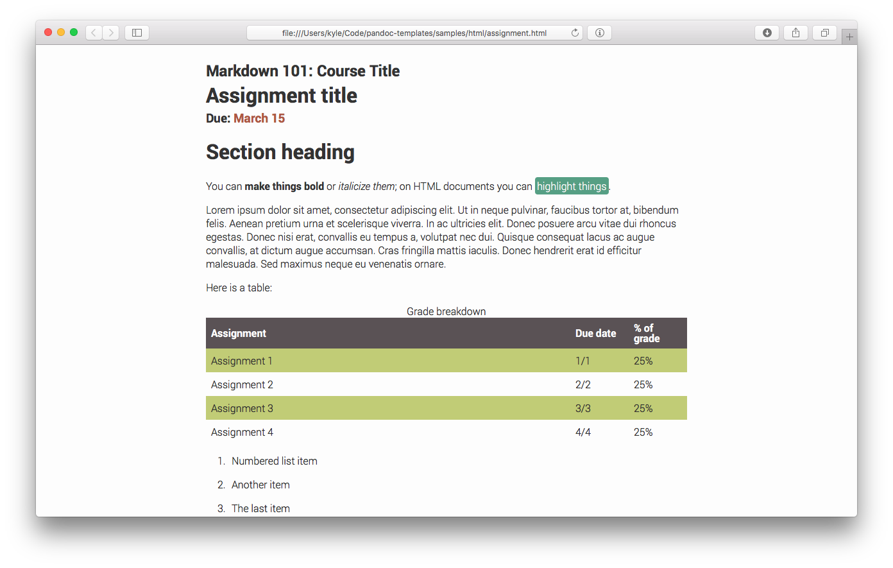
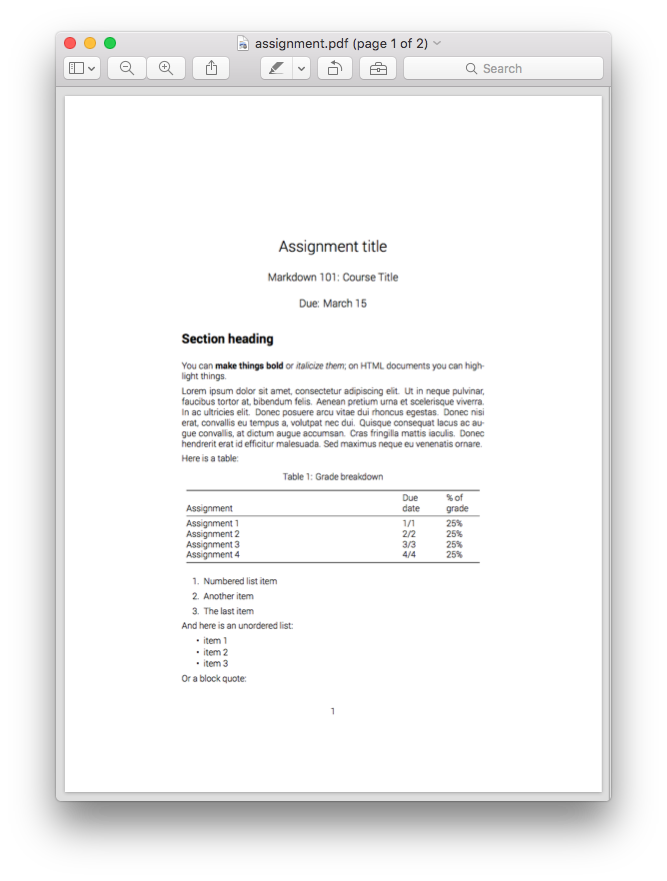
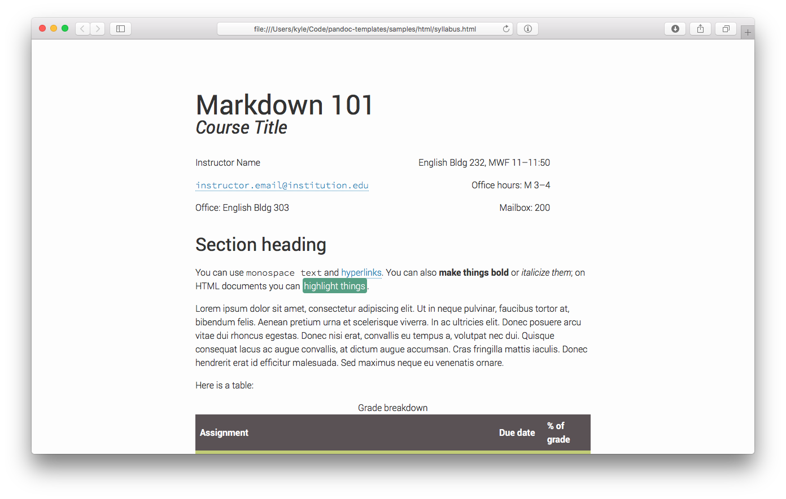
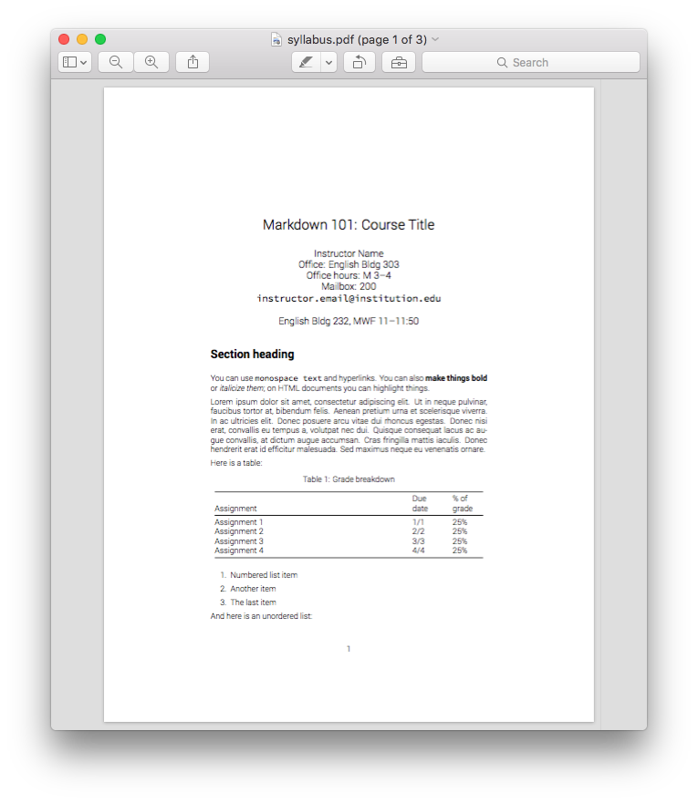
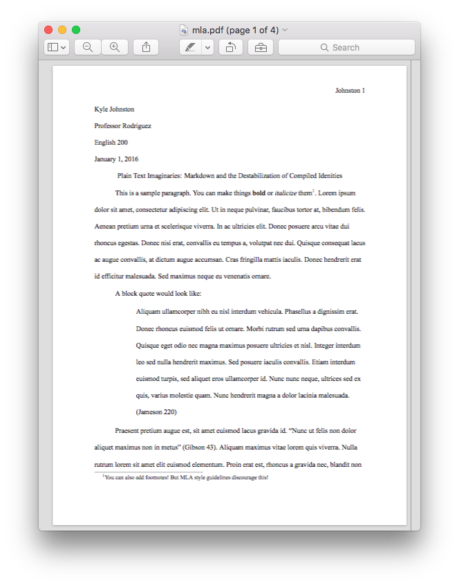

# MLA formatting, syllabus and assignment, and resume templates for pandoc

## NOTE: MLA/syllabus/assignment templates are no longer actively maintained
I changed careers and haven't written a paper or a syllabus in a few years, so these templates have not been tested in a while. Given the rate of change in the LaTeX ecosystem they probably still work fine, but I welcome pull requests from anyone actively using them who finds issues.

## Overview
This is a fork of John MacFarlane’s [pandoc-templates](https://github.com/jgm/pandoc-templates) which adds some additional custom templates. I originally forked it to house a couple custom templates I had made while in an English lit grad program for producing MLA formatted papers and syllabi and assignments for the classes I was teaching. I now mostly just maintain the resume template, which is a wrapper for the [moderncv](https://ctan.org/pkg/moderncv?lang=en) LaTeX template.

Browse the `samples/` directory to see what the templates generate. Everything in the `samples/html` and `samples/pdf` directories was generated by the corresponding file in the `samples/markdown` directory.

## Install

### Requirements

The instructions below will work on OS X and \*nix systems. You’ll need to alter file paths for Windows.

You will first need to [install pandoc](http://pandoc.org/installing.html) and a LaTeX distribution. **I have only tested these templates with XeTeX**. If you’re on a Mac, I recommend installing [the MacTeX distribution](https://tug.org/mactex/).

To use the MLA template, you’ll need to download the [Modern Language Association 7th Edition Citation Style Language file from the Zotero Style Repository](https://www.zotero.org/styles/modern-language-association) and save it to `~/.csl/modern-language-association.csl`.

The assignment and syllabus PDF templates use the [Roboto typeface](https://www.google.com/fonts/specimen/Roboto) which you’ll have to install on your machine.

### Installing

Step 1. Clone this repository to `~/.pandoc/templates`. Open the Terminal in OS X and type: 

    $ git clone https://github.com/kylerjohnston/pandoc-templates.git ~/.pandoc/templates

Step 2. (Kind of optional) You should copy `mla-xetex/mla-xetex.sty` to your local texmf directory and run `texhash`. `mla-xetex` is a patched version of Ryan Aycock’s [mla-paper TeX package](https://www.ctan.org/pkg/mla-paper) which will work with XeTeX (the LaTeX engine I use in the examples below---it is installed with both the full and small distributions of MacTeX and allows you to use your system’s fonts rather than dealing with complicated LaTeX font magic). **You don’t have to do this if you don’t want to use the MLA template or if you want to use pdflatex for your LaTeX engine**.

    $ cp mla-xetex/mla-xetex.sty /usr/local/texlive/texmf-local/tex/latex/local/ && texhash

## Use

Each of the templates requires different YAML metadata at the beginning of your markdown file. For example, a syllabus written looks like:

    ---
    course:
      num: Markdown 101
      title: Writing Markdown, Ditching MS Word
      instructor: Kyle Johnston
      time: English bldg 200, MWF 11--12
    contact:
      email: instructor.email@institution.edu
      office: English bldg 304
      office_hours: M 3--4
      mailbox: 200
    ---

    # Heading 1

    This class is about blah blah blah

The metadata should be self-explanatory. Take a look at the samples in the `samples/markdown` directory to see the required metadata for each template.

To compile your documents as PDFs, run:

    $ pandoc document.md -o document.pdf --latex-engine=xelatex --template=assignment

The above command would compile a PDF using the assignment template. To use the syllabus template you would replace assignment with syllabus.

To compile HTML, run:

    $ pandoc document.md -o document.html -S -s --template=syllabus

The `-S` option turns on smart typography---`---` will turn into em-dashes and `--` will turn into en-dashes, straight quotes will turn curly, etc. `-s` generates a standalone HTML file you can upload to your course website, email to students, etc.

To compile an MLA document with a bibliography, you’ll need to use pandoc’s citeproc extension. You will need to put the path to your bibliography file and specify the `modern-language-association.csl` file in your YAML metadata. An example MLA markdown file might look like:

    ---
    auth:
      first: Kyle
      last: Johnston
    professor: Rodriguez
    course: English 301
    date: January 1, 2016
    title: "Plain Text Imaginaries: Markdown and the Destabilization of Compiled Idenities"
    bibliography: ~/bib/lit.bib
    csl: modern-language-association.csl
    ---

    This is your first paragraph. Etc. etc. ... To add a citation, I would do
    something like this. Marx said “The philosophers have only interpreted the
    world, in various ways; the point is to change it” [@marxTheses 20].

    ...

    \workscited

Note a couple things:

1. I wrap the title in quotation marks because it contains a colon, which would invalidate the YAML. These quotation marks won’t appear on your compiled document! They are just so that the YAML can parse correctly.

2. I cite a source by referencing its citation key.

3. I end the document with `\workscited` which will automatically generate a Works Cited page for me with all of the sources I referenced in the document.

To compile this document you would run the command:

    $ pandoc mla.md -o mla.pdf --template=mla --latex-engine=xelatex --filter pandoc-citeproc

## License
[jgm/pandoc-templates](https://github.com/jgm/pandoc-templates) contains this license:
All of the templates in this repository are dual licensed, under both
the GPL (v2 or higher, same as pandoc) and the BSD 3-clause license
(included below).

Copyright (c) 2014--2017, John MacFarlane

All rights reserved.

Redistribution and use in source and binary forms, with or without
modification, are permitted provided that the following conditions are met:

* Redistributions of source code must retain the above copyright
  notice, this list of conditions and the following disclaimer.

* Redistributions in binary form must reproduce the above
  copyright notice, this list of conditions and the following
  disclaimer in the documentation and/or other materials provided
  with the distribution.

* Neither the name of John MacFarlane nor the names of other
  contributors may be used to endorse or promote products derived
  from this software without specific prior written permission.

THIS SOFTWARE IS PROVIDED BY THE COPYRIGHT HOLDERS AND CONTRIBUTORS
"AS IS" AND ANY EXPRESS OR IMPLIED WARRANTIES, INCLUDING, BUT NOT
LIMITED TO, THE IMPLIED WARRANTIES OF MERCHANTABILITY AND FITNESS FOR
A PARTICULAR PURPOSE ARE DISCLAIMED. IN NO EVENT SHALL THE COPYRIGHT
OWNER OR CONTRIBUTORS BE LIABLE FOR ANY DIRECT, INDIRECT, INCIDENTAL,
SPECIAL, EXEMPLARY, OR CONSEQUENTIAL DAMAGES (INCLUDING, BUT NOT
LIMITED TO, PROCUREMENT OF SUBSTITUTE GOODS OR SERVICES; LOSS OF USE,
DATA, OR PROFITS; OR BUSINESS INTERRUPTION) HOWEVER CAUSED AND ON ANY
THEORY OF LIABILITY, WHETHER IN CONTRACT, STRICT LIABILITY, OR TORT
(INCLUDING NEGLIGENCE OR OTHERWISE) ARISING IN ANY WAY OUT OF THE USE
OF THIS SOFTWARE, EVEN IF ADVISED OF THE POSSIBILITY OF SUCH DAMAGE.

The few templates I've added contain the same license, but

Copyright (c) 2016--2019, Kyle Johnston
